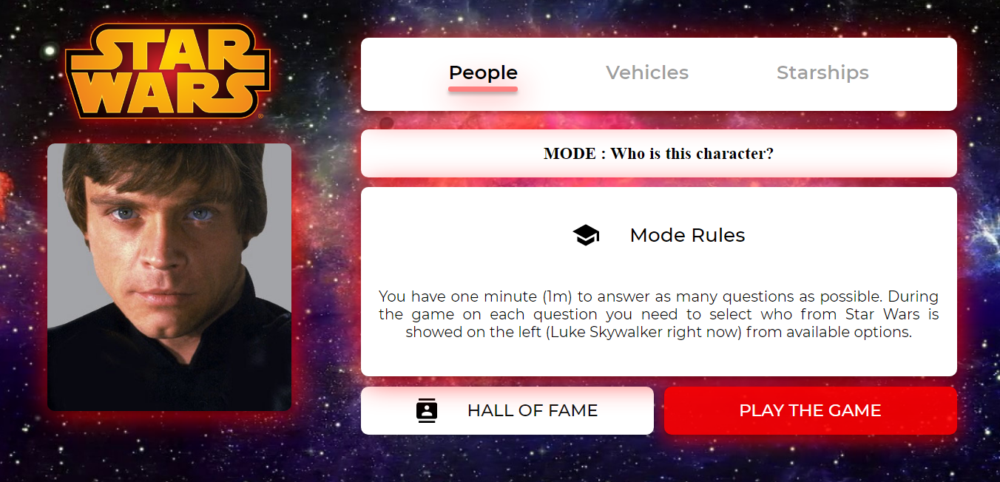
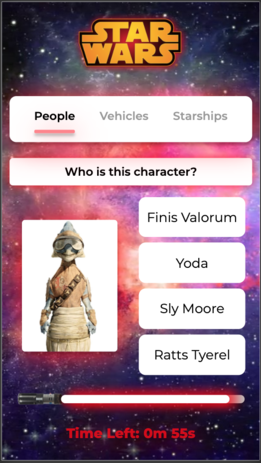
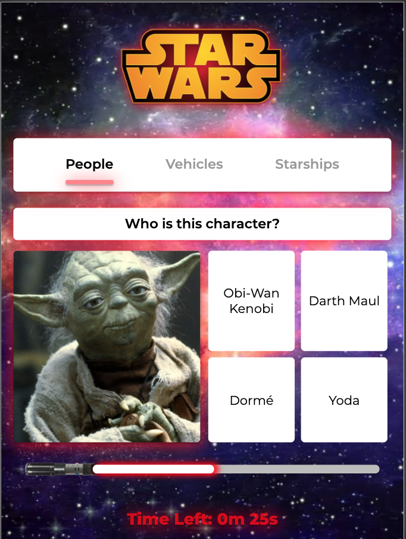

# 💥 Star Wars Quiz

Quiz wiedzy dotyczący serii Star Wars w formie aplikacji webowej wykorzystującej Star Wars API. Pozwala na wybór jednego z trzech dostępnych trybów gry (*People*, *Vehicles*, *Starships*) oraz zapis trzech najlepszych wyników. Rozgrywka ograniczona czasowo.

Aplikacja stworzona jako drugi projekt w ramach CodersCamp 2020.

## 🔥 Wersja live
Działającą aplikację znajdziesz tutaj: [Star Wars Quiz](https://agitated-ride-b7a9d5.netlify.app/).

## 📱 Wsparcie dla urządzeń mobilnych
Quiz jest w pełni funkcjonalny również na urządzeniach moblinych:

- smartfon (*iPhone 6/7/8*):

- tablet (*iPad Pro*):

## 💻 Wykorzystane technologie
- JavaScript
- HTML5
- CSS3
- SCSS
- Star Wars API

## 🖼 Projekt graficzny
Prototyp interfejsu desktopowej wersji aplikacji: [https://www.figma.com/proto/4HOOjnEYjb7W7xEh2Vb4lx/CodersCamp2020.Project.JavaScript.StarWarsQuiz?node-id=256%3A127&scaling=min-zoo](https://www.figma.com/proto/4HOOjnEYjb7W7xEh2Vb4lx/CodersCamp2020.Project.JavaScript.StarWarsQuiz?node-id=256%3A127&scaling=min-zoo).
